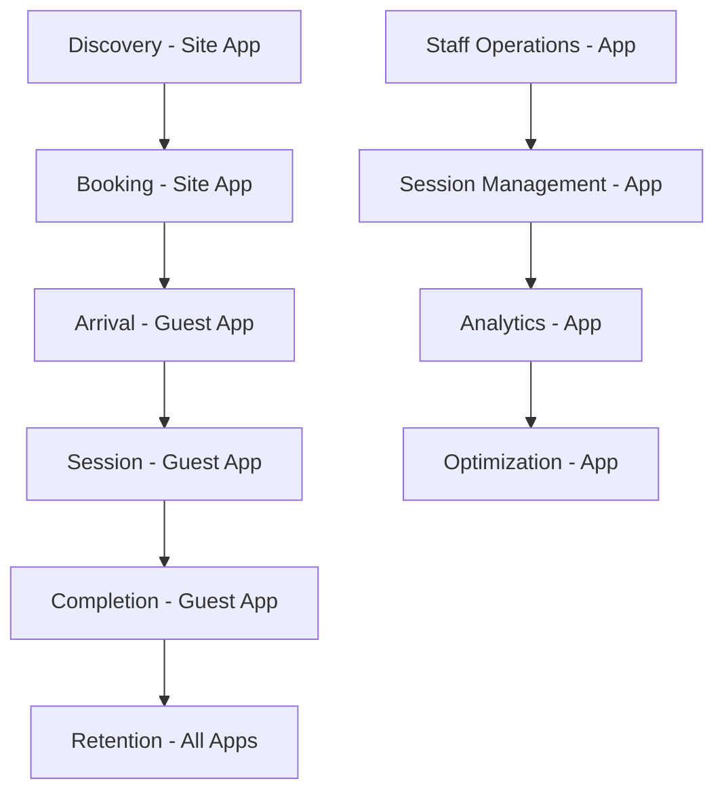

# 🎭 Hookah+ Customer Journey Mapping

**Complete customer experience from discovery to loyalty across all touchpoints**

---

## 🗺️ Journey Overview



---

## 📱 Phase 1: Discovery & Booking (Site App)

### Touchpoint 1: Landing Page Experience

#### Customer State: **Curious Explorer**
- **Emotions:** Curiosity, excitement, uncertainty
- **Goals:** Understand value, check pricing, see if it's worth it
- **Pain Points:** Don't know what to expect, pricing concerns, quality doubts

#### Experience Design:

**Hero Section - "Premium Hookah Experience Awaits"**
```
🎯 Value Proposition:
"Experience hookah like never before with our timed session model. 
Premium service, premium flavors, premium memories."

📊 Key Elements:
- Compelling headline with emotional appeal
- High-quality video of lounge experience
- Clear pricing display with tier comparison
- Social proof (reviews, ratings, customer photos)
- Strong CTA: "Reserve Your Session Now"
```

**Interactive Pricing Calculator**
```
💰 Dynamic Pricing Display:
- Real-time rates based on current demand
- Tier comparison (Basic $25, Premium $35, VIP $50)
- Time-based pricing (peak hours highlighted)
- Loyalty program benefits preview
- "Why timed sessions?" explanation
```

**Virtual Lounge Tour**
```
🏛️ 360° Experience:
- Interactive lounge walkthrough
- Table views with QR code explanation
- Staff interaction preview
- Equipment showcase
- Ambiance and atmosphere
```

#### Revenue Optimization:
- **A/B Test** different value propositions
- **Showcase premium tiers** prominently
- **Highlight time-limited offers**
- **Social proof** placement for maximum impact

---

### Touchpoint 2: Booking Process

#### Customer State: **Ready to Book**
- **Emotions:** Excitement, anticipation, slight anxiety about cost
- **Goals:** Select session type, choose time, complete payment
- **Pain Points:** Time selection, add-on decisions, payment security

#### Experience Flow:

**Step 1: Session Selection**
```
🎯 Visual Tier Comparison:
┌─────────────────┬─────────────────┬─────────────────┐
│   BASIC SESSION │ PREMIUM SESSION │   VIP SESSION   │
│     45 min      │     60 min      │     90 min      │
│     $25         │      $35        │      $50        │
│                 │                 │                 │
│ • Single flavor │ • 2 flavors     │ • 3+ flavors    │
│ • Standard eq   │ • Premium eq    │ • Luxury eq     │
│ • Basic service │ • Enhanced svc  │ • Personal att  │
│                 │                 │                 │
│ [SELECT]        │ [SELECT] ⭐     │ [SELECT]        │
└─────────────────┴─────────────────┴─────────────────┘

💡 Smart Recommendations:
- "Most Popular" badge on Premium tier
- "Best Value" indicator
- "First Time?" suggestion for Basic
- "Special Occasion?" push for VIP
```

**Step 2: Time Selection**
```
📅 Availability Calendar:
- Real-time availability display
- Demand indicators (High/Medium/Low)
- Peak hour pricing clearly marked
- "Recommended times" based on customer profile
- Group booking options

⏰ Time Slots:
┌─────────────────────────────────────────┐
│ Today - October 6, 2025                │
│                                         │
│ 2:00 PM  [AVAILABLE]  $25              │
│ 3:00 PM  [LOW DEMAND] $25              │
│ 4:00 PM  [AVAILABLE]  $25              │
│ 5:00 PM  [MEDIUM]     $30              │
│ 6:00 PM  [HIGH]       $35              │
│ 7:00 PM  [PEAK]       $40              │
│ 8:00 PM  [PEAK]       $40              │
│ 9:00 PM  [HIGH]       $35              │
└─────────────────────────────────────────┘
```

**Step 3: Add-ons & Upgrades**
```
🎁 Smart Upselling:
- "Complete Your Experience" section
- Flavor upgrade options ($3-5 each)
- Equipment upgrades ($10)
- Personal attendant ($15)
- Food & beverage packages
- Next visit incentives

💡 AI-Powered Suggestions:
- "Customers who booked Premium also added..."
- "Popular combinations for this time slot"
- "Limited time offers"
- "Loyalty member discounts"
```

**Step 4: Pricing Summary**
```
💰 Transparent Cost Breakdown:
┌─────────────────────────────────────────┐
│ Premium Session (60 min)        $35.00 │
│ + Blue Mist Flavor Upgrade       $4.00 │
│ + Premium Equipment              $10.00 │
│ + Peak Hour Surcharge (7 PM)     $7.00 │
│ ─────────────────────────────────────── │
│ Subtotal                         $56.00 │
│ Loyalty Discount (Silver)        -$8.40 │
│ ─────────────────────────────────────── │
│ Total                           $47.60  │
│ ─────────────────────────────────────── │
│ You Save: $8.40 with Silver Tier!      │
└─────────────────────────────────────────┘
```

**Step 5: Payment & Confirmation**
```
💳 Secure Checkout:
- Multiple payment options (Card, Apple Pay, Google Pay)
- Guest checkout or account creation
- Loyalty program signup during payment
- Security badges and trust indicators

✅ Confirmation:
- QR code for table access
- Session details and instructions
- Contact information for questions
- "Share your experience" social options
```

#### Revenue Optimization:
- **Upsell premium tiers** during selection
- **Suggest add-ons** based on selection
- **Offer loyalty program** signup
- **Time-based pricing** creates urgency
- **Social proof** reduces hesitation

---

## 📱 Phase 2: Arrival & Setup (Guest App)

### Touchpoint 3: Check-in Experience

#### Customer State: **Arrived & Excited**
- **Emotions:** Anticipation, excitement, slight impatience
- **Goals:** Quick check-in, start session, begin experience
- **Pain Points:** Finding table, understanding process, waiting

#### Experience Flow:

**Step 1: QR Code Scan**
```
📱 Instant Recognition:
- Camera opens automatically
- Table detection with confirmation
- "Welcome to Table T-001!" message
- Session details display
- Staff notification sent

🎯 Visual Feedback:
┌─────────────────────────────────────────┐
│ ✅ Table T-001 Detected!               │
│                                         │
│ Premium Session (60 min) - $35         │
│ Started: 7:00 PM                       │
│ Ends: 8:00 PM                          │
│                                         │
│ [START SESSION] [NEED HELP]            │
└─────────────────────────────────────────┘
```

**Step 2: Welcome & Setup**
```
👋 Personalized Greeting:
- "Welcome back, John!" (if returning customer)
- Session tier confirmation
- Time remaining display
- Flavor selection reminder
- Service request options

🎨 Brand Experience:
- Lounge ambiance music
- Visual theme matching lounge
- Smooth animations
- Professional but friendly tone
```

**Step 3: Flavor Selection**
```
🍃 AI-Powered Recommendations:
- "Based on your history, you might like..."
- "Popular this week" suggestions
- "Premium flavors" for VIP tier
- "New arrivals" highlights
- "Staff favorites" recommendations

🎯 Visual Selection:
┌─────────────────────────────────────────┐
│ Choose Your Flavors (2 included)       │
│                                         │
│ ⭐ Blue Mist (Your favorite)            │
│   Mint Fresh (Staff recommended)       │
│   Double Apple (Popular)               │
│   + Add More ($4 each)                 │
│                                         │
│ [CONFIRM SELECTION]                     │
└─────────────────────────────────────────┘
```

**Step 4: Session Start**
```
🚀 Session Activation:
- Timer starts automatically
- Staff notification sent
- Equipment preparation begins
- Customer receives confirmation
- "Your session is being prepared!"

⏰ Live Timer Display:
┌─────────────────────────────────────────┐
│ Session Active - Premium (60 min)      │
│                                         │
│ ⏱️ 00:00 / 60:00                       │
│ ████████████████████████████████████   │
│                                         │
│ Flavors: Blue Mist, Mint Fresh         │
│ Status: Being Prepared                  │
│                                         │
│ [REQUEST SERVICE] [EXTEND SESSION]      │
└─────────────────────────────────────────┘
```

#### Revenue Optimization:
- **Immediate upgrades** offered
- **Premium flavors** suggested
- **Service requests** enabled
- **Extension options** visible

---

### Touchpoint 4: Active Session Experience

#### Customer State: **Enjoying Session**
- **Emotions:** Relaxation, satisfaction, occasional need for service
- **Goals:** Maximize enjoyment, extend if desired, order additional items
- **Pain Points:** Service requests, flavor changes, time management

#### Experience Flow:

**Live Session Dashboard**
```
📊 Real-time Session Status:
┌─────────────────────────────────────────┐
│ Premium Session - Table T-001          │
│                                         │
│ ⏱️ 25:30 / 60:00 remaining             │
│ ████████████████████████████████████   │
│                                         │
│ Current Flavors:                        │
│ • Blue Mist (Active)                    │
│ • Mint Fresh (Ready)                    │
│                                         │
│ Session Status: Active                  │
│ Staff: Sarah (FOH)                      │
│                                         │
│ [CHANGE FLAVOR] [REQUEST SERVICE]       │
│ [EXTEND TIME] [ORDER FOOD]              │
└─────────────────────────────────────────┘
```

**Service Request System**
```
🛎️ Quick Service Options:
- "Need Help" - General assistance
- "Flavor Change" - Switch to next flavor
- "Equipment Issue" - Technical problems
- "Order Food/Drinks" - Additional items
- "Extend Session" - Add more time
- "Call Staff" - Direct communication

📱 Smart Notifications:
- "Your Blue Mist is ready!"
- "5 minutes remaining - extend now?"
- "Sarah is on the way with your order"
- "New flavor recommendation available"
```

**Extension & Upselling**
```
⏰ Time Management:
- Proactive extension offers at 10 min remaining
- Urgent offers at 5 min remaining
- Grace period with premium pricing
- Loyalty member discounts
- Group extension options

💰 Smart Offers:
- "Extend by 15 min for $8 (Save $2 with Silver tier)"
- "Upgrade to VIP for remaining time - $15"
- "Add premium flavor for $4"
- "Order food package - $12"
```

**Social & Engagement Features**
```
📱 Social Sharing:
- "Share your experience" with photos
- "Rate this session" feedback
- "Invite friends" referral system
- "Check-in" social media integration
- "Loyalty points earned" notifications

🎮 Gamification:
- Session achievements
- Flavor exploration badges
- Loyalty tier progress
- Referral rewards
- Social challenges
```

#### Revenue Optimization:
- **Proactive extension** offers
- **Contextual add-on** suggestions
- **Loyalty point** incentives
- **Social sharing** drives referrals
- **Gamification** increases engagement

---

## 📱 Phase 3: Completion & Retention (All Apps)

### Touchpoint 5: Session End

#### Customer State: **Session Concluding**
- **Emotions:** Satisfaction, slight disappointment it's ending, consideration of return
- **Goals:** Complete payment, provide feedback, plan return visit
- **Pain Points:** Payment process, feedback collection, next visit planning

#### Experience Flow:

**Final Extension Offer**
```
⏰ Last Chance Extensions:
- "Session ending in 2 minutes"
- "Extend now for $8 (regular $10)"
- "Upgrade to VIP for remaining time"
- "Book next session with 20% discount"
- "Join loyalty program for future savings"

💰 Urgency Pricing:
- Early extension: Standard rate
- Last minute: +20% premium
- Grace period: +50% premium
- Loyalty members: Discounted rates
```

**Payment Processing**
```
💳 Seamless Payment:
- Automatic payment if pre-authorized
- Manual payment with multiple options
- Loyalty points redemption
- Tip options for staff
- Receipt via email/SMS

✅ Payment Confirmation:
- Transaction successful
- Loyalty points earned
- Receipt sent
- Next visit incentives
- Feedback request
```

**Feedback Collection**
```
⭐ Experience Rating:
- Overall session rating (1-5 stars)
- Flavor quality rating
- Service quality rating
- Equipment rating
- Value for money rating
- Specific feedback text
- Staff recognition
- Improvement suggestions
```

**Loyalty Program Engagement**
```
🎁 Rewards & Recognition:
- Points earned this session
- Total points balance
- Tier progress display
- Next tier benefits
- Available rewards
- Referral bonuses
- Social sharing rewards

📈 Progress Tracking:
┌─────────────────────────────────────────┐
│ Silver Tier Progress                    │
│                                         │
│ ████████████████████████████████████   │
│ 750 / 1000 points to Gold              │
│                                         │
│ Earned this session: 47 points         │
│ Next reward: 10% off next visit        │
│                                         │
│ [VIEW REWARDS] [SHARE PROGRESS]        │
└─────────────────────────────────────────┘
```

**Next Visit Planning**
```
📅 Future Booking:
- "Book your next session now"
- "Same time next week?" suggestions
- "Try our VIP experience" upsell
- "Bring friends" group booking
- "Special events" calendar

🎯 Personalized Offers:
- "Your favorite Blue Mist is back in stock"
- "New premium flavors just arrived"
- "Weekend special: 20% off Premium sessions"
- "Refer a friend: Get $10 off your next visit"
```

#### Revenue Optimization:
- **Final extension** push
- **Loyalty program** enrollment
- **Referral incentives**
- **Next visit** booking
- **Feedback** drives improvement

---

### Touchpoint 6: Post-Visit Engagement

#### Customer State: **Left Lounge**
- **Emotions:** Satisfaction, nostalgia, consideration of return
- **Goals:** Stay connected, plan return visit, share experience
- **Pain Points:** Forgetting to return, losing connection, missing offers

#### Experience Flow:

**Thank You & Follow-up**
```
📧 Immediate Follow-up:
- "Thank you for visiting Hookah+!"
- Session summary and highlights
- Photos from the experience
- Staff appreciation message
- Next visit incentives

📱 Push Notifications:
- "Rate your experience" (1 hour later)
- "Share your photos" (2 hours later)
- "Book your next session" (1 day later)
- "Special offer just for you" (3 days later)
```

**Experience Summary**
```
📊 Session Recap:
┌─────────────────────────────────────────┐
│ Your Premium Session Summary            │
│                                         │
│ Date: October 6, 2025                  │
│ Duration: 60 minutes                   │
│ Flavors: Blue Mist, Mint Fresh         │
│ Staff: Sarah (FOH), Mike (BOH)         │
│ Rating: 5 stars ⭐⭐⭐⭐⭐                │
│                                         │
│ Points Earned: 47                       │
│ Total Points: 750                       │
│ Tier: Silver (250 to Gold)              │
│                                         │
│ [SHARE EXPERIENCE] [BOOK NEXT]          │
└─────────────────────────────────────────┘
```

**Loyalty Program Engagement**
```
🎁 Rewards & Benefits:
- Available rewards display
- Tier benefits explanation
- Referral program details
- Social sharing rewards
- Exclusive member offers

📈 Progress Visualization:
- Tier progress bar
- Points earned this month
- Rewards unlocked
- Next milestone
- Achievement badges
```

**Marketing & Retention**
```
📢 Targeted Campaigns:
- "Your favorite Blue Mist is back"
- "New premium flavors just arrived"
- "Weekend special: 20% off Premium"
- "Refer a friend: Get $10 off"
- "VIP experience: Try it for 50% off"

🎯 Personalized Offers:
- Based on session history
- Time-based promotions
- Seasonal campaigns
- Group booking incentives
- Loyalty member exclusives
```

**Social Sharing & Referrals**
```
📱 Social Integration:
- Share photos and experience
- Tag friends and invite them
- Post reviews and ratings
- Social media integration
- Referral tracking

🎁 Referral Rewards:
- "Invite a friend: Get $10 off"
- "Group booking: 15% off for 4+ people"
- "Social sharing: Earn 50 bonus points"
- "Review us: Get 25 points"
- "Check-in: Get 10 points"
```

#### Revenue Optimization:
- **Targeted campaigns** drive return visits
- **Loyalty program** increases lifetime value
- **Social sharing** drives new customers
- **Referral program** expands customer base
- **Personalized offers** increase conversion

---

## 🏢 Staff Operations Journey (App)

### Touchpoint 7: Staff Dashboard & Management

#### Staff State: **Operational Mode**
- **Goals:** Manage sessions efficiently, provide excellent service, maximize revenue
- **Pain Points:** Multiple tasks, time pressure, customer requests, system complexity

#### Experience Flow:

**Real-time Dashboard**
```
📊 Live Operations View:
┌─────────────────────────────────────────┐
│ Hookah+ Operations Dashboard           │
│                                         │
│ Active Sessions: 8/12 tables           │
│ Revenue Today: $1,247                  │
│ Avg Session Value: $45.67              │
│                                         │
│ Table T-001: Premium (25 min left)     │
│ Table T-003: VIP (45 min left)         │
│ Table T-005: Basic (5 min left) ⚠️     │
│ Table T-007: Premium (60 min left)     │
│                                         │
│ [VIEW ALL] [ALERTS] [ANALYTICS]        │
└─────────────────────────────────────────┘
```

**Session Management**
```
🎯 Session Control:
- Start/stop/pause sessions
- Assign staff to tables
- Handle service requests
- Process extensions
- Manage payments
- Track session status

⚠️ Alerts & Notifications:
- "Table T-005: 5 minutes remaining"
- "Table T-003: Service request - flavor change"
- "Table T-001: Payment pending"
- "New booking: Table T-009 at 8 PM"
- "Equipment issue: Table T-007"
```

**Staff Workflow Optimization**
```
👥 Role-based Interface:
- BOH: Equipment prep, flavor changes
- FOH: Customer service, payments
- Manager: Analytics, pricing, staff
- Admin: System settings, reports

🔄 Workflow Automation:
- Automatic staff assignments
- Service request routing
- Payment processing
- Session state management
- Customer communication
```

**Analytics & Insights**
```
📈 Performance Metrics:
- Revenue per hour
- Table utilization
- Staff efficiency
- Customer satisfaction
- Popular flavors
- Peak hours analysis

🎯 Optimization Suggestions:
- "Increase pricing by 10% during peak hours"
- "Table T-005 extension rate: 80% - consider upsell"
- "Blue Mist popularity: 45% - stock more"
- "Staff efficiency: Sarah 95%, Mike 87%"
- "Customer satisfaction: 4.7/5 - excellent!"
```

#### Revenue Optimization:
- **Real-time monitoring** enables quick decisions
- **Automated workflows** increase efficiency
- **Data-driven insights** optimize operations
- **Staff performance** tracking improves service
- **Customer satisfaction** drives retention

---

## 📊 Success Metrics & KPIs

### Customer Journey Metrics

#### Discovery & Booking (Site App)
- **Conversion Rate:** 15%+ of visitors book
- **Average Booking Value:** $45+ per session
- **Premium Tier Adoption:** 30%+ of bookings
- **Add-on Attachment Rate:** 60%+ of bookings
- **Loyalty Program Signup:** 70%+ of new customers

#### Arrival & Setup (Guest App)
- **Check-in Success Rate:** 95%+ of QR scans
- **Flavor Selection Time:** <2 minutes average
- **Session Start Time:** <5 minutes from arrival
- **Service Request Response:** <3 minutes average
- **Customer Satisfaction:** 4.5+ stars average

#### Active Session (Guest App)
- **Session Extension Rate:** 40%+ of sessions
- **Upselling Success Rate:** 60%+ of sessions
- **Service Request Resolution:** 95%+ within 5 minutes
- **Social Sharing Rate:** 30%+ of sessions
- **App Usage Rate:** 80%+ of customers use app

#### Completion & Retention (All Apps)
- **Payment Success Rate:** 98%+ of transactions
- **Feedback Collection Rate:** 70%+ of sessions
- **Loyalty Program Engagement:** 50%+ of members
- **Return Visit Rate:** 60%+ within 30 days
- **Referral Rate:** 25%+ of new customers

### Staff Operations Metrics

#### Efficiency Metrics
- **Table Turnover Rate:** 4+ sessions per table per day
- **Staff Efficiency:** 15+ orders per staff per shift
- **Order Processing Time:** <2 minutes average
- **Customer Wait Time:** <5 minutes average
- **System Uptime:** 99.9%+ availability

#### Quality Metrics
- **Customer Satisfaction:** 4.5+ stars average
- **Session Completion Rate:** 95%+ of started sessions
- **Staff Satisfaction:** 4.0+ stars average
- **Error Rate:** <1% of operations
- **Service Request Resolution:** 95%+ within 5 minutes

### Revenue Metrics

#### Primary KPIs
- **Monthly Recurring Revenue (MRR):** $50K+ per location
- **Average Revenue Per User (ARPU):** $45+ per session
- **Revenue per Table Hour:** $25+ per hour
- **Customer Lifetime Value (CLV):** $500+ per customer
- **Revenue Growth Rate:** 20%+ month-over-month

#### Secondary KPIs
- **Session Extension Revenue:** 25%+ of total revenue
- **Upselling Revenue:** 20%+ of total revenue
- **Loyalty Program Revenue:** 30%+ of total revenue
- **Referral Revenue:** 15%+ of new customer revenue
- **Premium Tier Revenue:** 40%+ of total revenue

---

## 🎯 Implementation Priorities

### Phase 1: Core Journey (Months 1-3)
1. **Site App** - Landing page and booking
2. **Guest App** - QR scanning and session management
3. **App** - Basic staff dashboard
4. **Payment Integration** - Stripe setup
5. **Basic Analytics** - Core metrics tracking

### Phase 2: Enhancement (Months 4-6)
1. **Dynamic Pricing** - Real-time pricing engine
2. **Loyalty Program** - Points and rewards
3. **Advanced Analytics** - Predictive insights
4. **Mobile Optimization** - Native app experience
5. **Social Features** - Sharing and referrals

### Phase 3: Optimization (Months 7-12)
1. **AI Recommendations** - Machine learning
2. **Advanced Workflows** - Staff automation
3. **Multi-location** - Franchise support
4. **API Ecosystem** - Third-party integration
5. **Market Expansion** - New locations

---

## 🚀 Next Steps

### Immediate Actions (Week 1)
1. **Review and approve** customer journey mapping
2. **Prioritize features** based on revenue impact
3. **Set up development** environment and team
4. **Create detailed** technical specifications
5. **Begin Phase 1** development

### Short-term Goals (Month 1)
1. **Complete Site App** landing page and booking
2. **Implement Guest App** QR scanning and basic features
3. **Set up App** staff dashboard and session management
4. **Integrate Stripe** payment processing
5. **Launch pilot** program at one location

### Long-term Vision (Year 1)
1. **Scale to multiple** locations
2. **Implement AI-powered** features
3. **Achieve $1M+** annual revenue
4. **Establish market** leadership
5. **Prepare for** franchise expansion

---

**Document Version:** 1.0  
**Created:** October 6, 2025  
**Status:** Ready for Implementation  
**Next Steps:** Begin Phase 1 development

