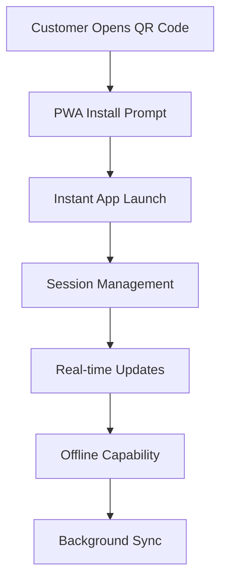

# 📱 Mobile-First Customer Experience Design

**Revolutionary mobile experience for the Hookah+ timed session system**

---

## 🎯 Mobile Experience Philosophy

### Core Principles
1. **Thumb-Friendly Design** - All interactions within thumb reach
2. **One-Handed Operation** - Complete experience with single hand
3. **Instant Gratification** - Immediate feedback and responses
4. **Contextual Intelligence** - Smart suggestions based on behavior
5. **Seamless Transitions** - Smooth flow between touchpoints

---

## 📱 App Architecture

### Progressive Web App (PWA) Strategy



### App Shell Architecture
- **Instant Loading** - App shell loads in <1 second
- **Offline First** - Core functionality works without internet
- **Background Sync** - Data syncs when connection restored
- **Push Notifications** - Real-time session updates
- **Native Feel** - Smooth animations and transitions

---

## 🎨 User Interface Design

### 1. Landing & Onboarding

#### QR Code Scan Experience
```typescript
// apps/guest/components/QRScanner.tsx
export function QRScanner({ onScan, onError }: QRScannerProps) {
  const [isScanning, setIsScanning] = useState(false);
  const [hasPermission, setHasPermission] = useState(false);

  return (
    <div className="min-h-screen bg-gradient-to-br from-purple-900 to-blue-900 flex flex-col">
      {/* Header */}
      <div className="p-6 text-center">
        <h1 className="text-3xl font-bold text-white mb-2">
          Welcome to Hookah+
        </h1>
        <p className="text-purple-200">
          Scan the QR code on your table to start
        </p>
      </div>

      {/* Camera View */}
      <div className="flex-1 relative">
        <div className="absolute inset-0 bg-black rounded-t-3xl overflow-hidden">
          <QRCodeScanner
            onScan={handleScan}
            onError={handleError}
            style={{ width: '100%', height: '100%' }}
          />
          
          {/* Overlay */}
          <div className="absolute inset-0 flex items-center justify-center">
            <div className="w-64 h-64 border-2 border-white rounded-lg opacity-50">
              <div className="absolute top-0 left-0 w-6 h-6 border-t-2 border-l-2 border-white rounded-tl-lg"></div>
              <div className="absolute top-0 right-0 w-6 h-6 border-t-2 border-r-2 border-white rounded-tr-lg"></div>
              <div className="absolute bottom-0 left-0 w-6 h-6 border-b-2 border-l-2 border-white rounded-bl-lg"></div>
              <div className="absolute bottom-0 right-0 w-6 h-6 border-b-2 border-r-2 border-white rounded-br-lg"></div>
            </div>
          </div>
        </div>
      </div>

      {/* Instructions */}
      <div className="p-6 bg-white rounded-t-3xl">
        <div className="text-center">
          <div className="w-16 h-16 bg-purple-100 rounded-full flex items-center justify-center mx-auto mb-4">
            <QrCode className="w-8 h-8 text-purple-600" />
          </div>
          <h3 className="text-lg font-semibold text-gray-800 mb-2">
            Point camera at QR code
          </h3>
          <p className="text-gray-600 text-sm">
            The QR code is located on your table
          </p>
        </div>
      </div>
    </div>
  );
}
```

#### Welcome & Setup Flow
```typescript
// apps/guest/components/WelcomeFlow.tsx
export function WelcomeFlow({ tableId, customerData }: WelcomeFlowProps) {
  const [currentStep, setCurrentStep] = useState(0);
  const [isReturning, setIsReturning] = useState(false);

  const steps = [
    {
      title: "Welcome Back!",
      subtitle: `Table ${tableId}`,
      content: <WelcomeStep customerData={customerData} />,
      action: "Continue"
    },
    {
      title: "Choose Your Experience",
      subtitle: "Select your session tier",
      content: <TierSelectionStep />,
      action: "Select Tier"
    },
    {
      title: "Pick Your Flavors",
      subtitle: "Up to 3 flavors included",
      content: <FlavorSelectionStep />,
      action: "Confirm Flavors"
    },
    {
      title: "Review & Pay",
      subtitle: "Secure payment processing",
      content: <PaymentStep />,
      action: "Start Session"
    }
  ];

  return (
    <div className="min-h-screen bg-gradient-to-br from-purple-900 to-blue-900">
      {/* Progress Indicator */}
      <div className="p-6">
        <div className="flex items-center justify-center space-x-2 mb-6">
          {steps.map((_, index) => (
            <div
              key={index}
              className={`w-3 h-3 rounded-full ${
                index <= currentStep ? 'bg-white' : 'bg-white/30'
              }`}
            />
          ))}
        </div>
      </div>

      {/* Step Content */}
      <div className="px-6 pb-6">
        <div className="bg-white rounded-3xl p-6 min-h-[400px]">
          <div className="text-center mb-6">
            <h2 className="text-2xl font-bold text-gray-800 mb-2">
              {steps[currentStep].title}
            </h2>
            <p className="text-gray-600">
              {steps[currentStep].subtitle}
            </p>
          </div>

          {steps[currentStep].content}

          <div className="mt-8">
            <button
              onClick={() => setCurrentStep(prev => prev + 1)}
              className="w-full bg-gradient-to-r from-purple-600 to-blue-600 text-white py-4 rounded-2xl font-semibold text-lg"
            >
              {steps[currentStep].action}
            </button>
          </div>
        </div>
      </div>
    </div>
  );
}
```

### 2. Session Management Interface

#### Live Session Dashboard
```typescript
// apps/guest/components/SessionDashboard.tsx
export function SessionDashboard({ sessionId }: SessionDashboardProps) {
  const [session, setSession] = useState<Session | null>(null);
  const [timer, setTimer] = useState<TimerStatus | null>(null);

  return (
    <div className="min-h-screen bg-gradient-to-br from-purple-900 to-blue-900">
      {/* Header */}
      <div className="p-6 text-center">
        <h1 className="text-2xl font-bold text-white mb-2">
          Table {session?.tableId}
        </h1>
        <p className="text-purple-200">
          {session?.tier} Session - {session?.durationMinutes} minutes
        </p>
      </div>

      {/* Timer Card */}
      <div className="px-6 mb-6">
        <div className="bg-white rounded-3xl p-6 shadow-2xl">
          <div className="text-center mb-6">
            <div className="text-4xl font-bold text-gray-800 mb-2">
              {timer?.remainingMinutes || 0}
            </div>
            <div className="text-gray-600">minutes remaining</div>
          </div>

          {/* Progress Bar */}
          <div className="w-full bg-gray-200 rounded-full h-3 mb-6">
            <div
              className={`h-3 rounded-full transition-all duration-1000 ${
                timer?.remainingMinutes <= 5 ? 'bg-red-500' : 
                timer?.remainingMinutes <= 15 ? 'bg-yellow-500' : 'bg-green-500'
              }`}
              style={{ width: `${(timer?.remainingMinutes || 0) / (session?.durationMinutes || 60) * 100}%` }}
            />
          </div>

          {/* Extension Buttons */}
          <div className="grid grid-cols-3 gap-3">
            <button className="bg-purple-100 text-purple-700 py-3 rounded-xl font-semibold">
              +15 min
            </button>
            <button className="bg-purple-100 text-purple-700 py-3 rounded-xl font-semibold">
              +30 min
            </button>
            <button className="bg-purple-100 text-purple-700 py-3 rounded-xl font-semibold">
              +60 min
            </button>
          </div>
        </div>
      </div>

      {/* Quick Actions */}
      <div className="px-6 mb-6">
        <div className="grid grid-cols-2 gap-4">
          <button className="bg-white rounded-2xl p-4 text-center">
            <div className="w-12 h-12 bg-blue-100 rounded-full flex items-center justify-center mx-auto mb-2">
              <Flame className="w-6 h-6 text-blue-600" />
            </div>
            <div className="text-sm font-semibold text-gray-800">Change Flavor</div>
          </button>
          
          <button className="bg-white rounded-2xl p-4 text-center">
            <div className="w-12 h-12 bg-green-100 rounded-full flex items-center justify-center mx-auto mb-2">
              <Bell className="w-6 h-6 text-green-600" />
            </div>
            <div className="text-sm font-semibold text-gray-800">Request Service</div>
          </button>
          
          <button className="bg-white rounded-2xl p-4 text-center">
            <div className="w-12 h-12 bg-yellow-100 rounded-full flex items-center justify-center mx-auto mb-2">
              <Utensils className="w-6 h-6 text-yellow-600" />
            </div>
            <div className="text-sm font-semibold text-gray-800">Order Food</div>
          </button>
          
          <button className="bg-white rounded-2xl p-4 text-center">
            <div className="w-12 h-12 bg-purple-100 rounded-full flex items-center justify-center mx-auto mb-2">
              <Share2 className="w-6 h-6 text-purple-600" />
            </div>
            <div className="text-sm font-semibold text-gray-800">Share</div>
          </button>
        </div>
      </div>

      {/* Current Flavors */}
      <div className="px-6">
        <div className="bg-white rounded-2xl p-4">
          <h3 className="font-semibold text-gray-800 mb-3">Current Flavors</h3>
          <div className="space-y-2">
            {session?.flavors.map((flavor, index) => (
              <div key={index} className="flex items-center justify-between">
                <div className="flex items-center space-x-3">
                  <div className="w-3 h-3 bg-green-500 rounded-full"></div>
                  <span className="text-gray-700">{flavor.name}</span>
                </div>
                <button className="text-purple-600 text-sm">Change</button>
              </div>
            ))}
          </div>
        </div>
      </div>
    </div>
  );
}
```

### 3. Flavor Selection Experience

#### Interactive Flavor Picker
```typescript
// apps/guest/components/FlavorPicker.tsx
export function FlavorPicker({ 
  selectedFlavors, 
  onSelectionChange, 
  maxSelections = 3 
}: FlavorPickerProps) {
  const [flavors, setFlavors] = useState<Flavor[]>([]);
  const [searchTerm, setSearchTerm] = useState('');

  const filteredFlavors = flavors.filter(flavor =>
    flavor.name.toLowerCase().includes(searchTerm.toLowerCase()) ||
    flavor.description.toLowerCase().includes(searchTerm.toLowerCase())
  );

  return (
    <div className="space-y-6">
      {/* Search Bar */}
      <div className="relative">
        <Search className="absolute left-4 top-1/2 transform -translate-y-1/2 text-gray-400 w-5 h-5" />
        <input
          type="text"
          placeholder="Search flavors..."
          value={searchTerm}
          onChange={(e) => setSearchTerm(e.target.value)}
          className="w-full pl-12 pr-4 py-3 border border-gray-200 rounded-2xl focus:outline-none focus:ring-2 focus:ring-purple-500"
        />
      </div>

      {/* Flavor Grid */}
      <div className="grid grid-cols-2 gap-4">
        {filteredFlavors.map((flavor) => {
          const isSelected = selectedFlavors.some(f => f.id === flavor.id);
          const canSelect = selectedFlavors.length < maxSelections || isSelected;

          return (
            <button
              key={flavor.id}
              onClick={() => handleFlavorToggle(flavor)}
              disabled={!canSelect}
              className={`p-4 rounded-2xl border-2 transition-all ${
                isSelected
                  ? 'border-purple-500 bg-purple-50'
                  : canSelect
                  ? 'border-gray-200 bg-white hover:border-purple-300'
                  : 'border-gray-100 bg-gray-50 opacity-50'
              }`}
            >
              <div className="text-center">
                <div className="text-3xl mb-2">{flavor.emoji}</div>
                <div className="font-semibold text-gray-800 text-sm mb-1">
                  {flavor.name}
                </div>
                <div className="text-xs text-gray-600">
                  {flavor.description}
                </div>
                {flavor.popular && (
                  <div className="mt-2">
                    <span className="bg-yellow-100 text-yellow-800 text-xs px-2 py-1 rounded-full">
                      Popular
                    </span>
                  </div>
                )}
              </div>
            </button>
          );
        })}
      </div>

      {/* Selection Summary */}
      <div className="bg-purple-50 rounded-2xl p-4">
        <div className="flex items-center justify-between mb-2">
          <span className="font-semibold text-gray-800">
            Selected Flavors
          </span>
          <span className="text-sm text-gray-600">
            {selectedFlavors.length}/{maxSelections}
          </span>
        </div>
        <div className="flex flex-wrap gap-2">
          {selectedFlavors.map((flavor) => (
            <div
              key={flavor.id}
              className="flex items-center space-x-2 bg-white px-3 py-2 rounded-full"
            >
              <span>{flavor.emoji}</span>
              <span className="text-sm font-medium">{flavor.name}</span>
              <button
                onClick={() => handleFlavorRemove(flavor.id)}
                className="text-gray-400 hover:text-red-500"
              >
                <X className="w-4 h-4" />
              </button>
            </div>
          ))}
        </div>
      </div>
    </div>
  );
}
```

### 4. Payment & Checkout Flow

#### Streamlined Payment Experience
```typescript
// apps/guest/components/PaymentFlow.tsx
export function PaymentFlow({ session, onPaymentComplete }: PaymentFlowProps) {
  const [paymentMethod, setPaymentMethod] = useState<'card' | 'apple' | 'google'>('card');
  const [isProcessing, setIsProcessing] = useState(false);

  return (
    <div className="space-y-6">
      {/* Session Summary */}
      <div className="bg-gray-50 rounded-2xl p-4">
        <h3 className="font-semibold text-gray-800 mb-3">Session Summary</h3>
        <div className="space-y-2 text-sm">
          <div className="flex justify-between">
            <span className="text-gray-600">{session.tier} Session</span>
            <span className="font-medium">${(session.basePrice / 100).toFixed(2)}</span>
          </div>
          <div className="flex justify-between">
            <span className="text-gray-600">Duration</span>
            <span className="font-medium">{session.durationMinutes} minutes</span>
          </div>
          {session.flavors.map((flavor, index) => (
            <div key={index} className="flex justify-between">
              <span className="text-gray-600">{flavor.name}</span>
              <span className="font-medium">Included</span>
            </div>
          ))}
          {session.addOns.map((addon, index) => (
            <div key={index} className="flex justify-between">
              <span className="text-gray-600">{addon.name}</span>
              <span className="font-medium">+${(addon.price / 100).toFixed(2)}</span>
            </div>
          ))}
          <div className="border-t pt-2 mt-2">
            <div className="flex justify-between font-semibold text-lg">
              <span>Total</span>
              <span>${(session.totalPrice / 100).toFixed(2)}</span>
            </div>
          </div>
        </div>
      </div>

      {/* Payment Methods */}
      <div className="space-y-3">
        <h3 className="font-semibold text-gray-800">Payment Method</h3>
        
        <button
          onClick={() => setPaymentMethod('card')}
          className={`w-full p-4 rounded-2xl border-2 flex items-center space-x-3 ${
            paymentMethod === 'card' ? 'border-purple-500 bg-purple-50' : 'border-gray-200'
          }`}
        >
          <CreditCard className="w-6 h-6 text-gray-600" />
          <span className="font-medium">Credit/Debit Card</span>
        </button>

        <button
          onClick={() => setPaymentMethod('apple')}
          className={`w-full p-4 rounded-2xl border-2 flex items-center space-x-3 ${
            paymentMethod === 'apple' ? 'border-purple-500 bg-purple-50' : 'border-gray-200'
          }`}
        >
          <div className="w-6 h-6 bg-black rounded flex items-center justify-center">
            <span className="text-white text-xs font-bold">🍎</span>
          </div>
          <span className="font-medium">Apple Pay</span>
        </button>

        <button
          onClick={() => setPaymentMethod('google')}
          className={`w-full p-4 rounded-2xl border-2 flex items-center space-x-3 ${
            paymentMethod === 'google' ? 'border-purple-500 bg-purple-50' : 'border-gray-200'
          }`}
        >
          <div className="w-6 h-6 bg-blue-500 rounded flex items-center justify-center">
            <span className="text-white text-xs font-bold">G</span>
          </div>
          <span className="font-medium">Google Pay</span>
        </button>
      </div>

      {/* Security Badges */}
      <div className="flex items-center justify-center space-x-6 text-xs text-gray-500">
        <div className="flex items-center space-x-1">
          <Shield className="w-4 h-4" />
          <span>SSL Secured</span>
        </div>
        <div className="flex items-center space-x-1">
          <Lock className="w-4 h-4" />
          <span>PCI Compliant</span>
        </div>
      </div>

      {/* Pay Button */}
      <button
        onClick={handlePayment}
        disabled={isProcessing}
        className="w-full bg-gradient-to-r from-purple-600 to-blue-600 text-white py-4 rounded-2xl font-semibold text-lg disabled:opacity-50"
      >
        {isProcessing ? (
          <div className="flex items-center justify-center space-x-2">
            <div className="w-5 h-5 border-2 border-white border-t-transparent rounded-full animate-spin"></div>
            <span>Processing...</span>
          </div>
        ) : (
          `Pay $${(session.totalPrice / 100).toFixed(2)}`
        )}
      </button>
    </div>
  );
}
```

---

## 🔔 Real-time Notifications

### Push Notification System

```typescript
// apps/guest/lib/notifications.ts
export class NotificationManager {
  private static instance: NotificationManager;
  private registration: ServiceWorkerRegistration | null = null;

  static getInstance(): NotificationManager {
    if (!NotificationManager.instance) {
      NotificationManager.instance = new NotificationManager();
    }
    return NotificationManager.instance;
  }

  async requestPermission(): Promise<boolean> {
    if (!('Notification' in window)) {
      console.log('This browser does not support notifications');
      return false;
    }

    if (Notification.permission === 'granted') {
      return true;
    }

    if (Notification.permission !== 'denied') {
      const permission = await Notification.requestPermission();
      return permission === 'granted';
    }

    return false;
  }

  async registerServiceWorker(): Promise<void> {
    if ('serviceWorker' in navigator) {
      try {
        this.registration = await navigator.serviceWorker.register('/sw.js');
        console.log('Service Worker registered successfully');
      } catch (error) {
        console.error('Service Worker registration failed:', error);
      }
    }
  }

  async sendNotification(title: string, options: NotificationOptions): Promise<void> {
    if (this.registration && Notification.permission === 'granted') {
      await this.registration.showNotification(title, {
        ...options,
        icon: '/icon-192x192.png',
        badge: '/badge-72x72.png',
        vibrate: [200, 100, 200],
        requireInteraction: true
      });
    }
  }

  // Session-specific notifications
  async notifySessionStarted(session: Session): Promise<void> {
    await this.sendNotification('Session Started!', {
      body: `Your ${session.tier} session is now active`,
      tag: 'session-started',
      actions: [
        { action: 'view', title: 'View Session' },
        { action: 'extend', title: 'Extend Time' }
      ]
    });
  }

  async notifyTimeWarning(minutes: number): Promise<void> {
    await this.sendNotification('Time Almost Up!', {
      body: `${minutes} minutes remaining in your session`,
      tag: 'time-warning',
      actions: [
        { action: 'extend', title: 'Extend Now' },
        { action: 'view', title: 'View Session' }
      ]
    });
  }

  async notifySessionExpired(): Promise<void> {
    await this.sendNotification('Session Expired', {
      body: 'Your session has ended. Thank you for visiting!',
      tag: 'session-expired',
      actions: [
        { action: 'book', title: 'Book Again' },
        { action: 'review', title: 'Leave Review' }
      ]
    });
  }

  async notifyServiceRequest(service: string): Promise<void> {
    await this.sendNotification('Service Request', {
      body: `Your request for ${service} has been received`,
      tag: 'service-request',
      actions: [
        { action: 'view', title: 'View Status' }
      ]
    });
  }
}
```

### Notification Types

#### Session Notifications
- **Session Started** - Confirmation when session begins
- **Time Warnings** - 15 min, 5 min, 2 min remaining
- **Extension Offers** - Proactive extension suggestions
- **Session Expired** - Grace period and final notice
- **Service Updates** - Staff responses to requests

#### Engagement Notifications
- **Flavor Recommendations** - AI-powered suggestions
- **Special Offers** - Time-limited promotions
- **Loyalty Updates** - Points earned, tier progress
- **Social Features** - Friend invitations, sharing rewards
- **Feedback Requests** - Post-session surveys

---

## 🎮 Gamification Elements

### Loyalty Points System

```typescript
// apps/guest/components/LoyaltyCard.tsx
export function LoyaltyCard({ customer }: LoyaltyCardProps) {
  const [loyalty, setLoyalty] = useState<LoyaltyStatus | null>(null);

  const getTierColor = (tier: string) => {
    switch (tier) {
      case 'BRONZE': return 'from-yellow-600 to-yellow-800';
      case 'SILVER': return 'from-gray-400 to-gray-600';
      case 'GOLD': return 'from-yellow-400 to-yellow-600';
      case 'PLATINUM': return 'from-purple-500 to-purple-700';
      default: return 'from-gray-300 to-gray-500';
    }
  };

  const getTierIcon = (tier: string) => {
    switch (tier) {
      case 'BRONZE': return '🥉';
      case 'SILVER': return '🥈';
      case 'GOLD': return '🥇';
      case 'PLATINUM': return '💎';
      default: return '⭐';
    }
  };

  return (
    <div className="bg-gradient-to-r from-purple-600 to-blue-600 rounded-3xl p-6 text-white">
      <div className="flex items-center justify-between mb-4">
        <div>
          <h3 className="text-lg font-semibold">Loyalty Status</h3>
          <p className="text-purple-200 text-sm">Earn points with every visit</p>
        </div>
        <div className="text-3xl">{getTierIcon(loyalty?.tier || 'BRONZE')}</div>
      </div>

      <div className="mb-4">
        <div className="flex items-center justify-between mb-2">
          <span className="text-sm font-medium">{loyalty?.tier || 'BRONZE'} Tier</span>
          <span className="text-sm">{loyalty?.points || 0} points</span>
        </div>
        <div className="w-full bg-white/20 rounded-full h-2">
          <div
            className="bg-white rounded-full h-2 transition-all duration-500"
            style={{ width: `${(loyalty?.points || 0) / (loyalty?.nextTierPoints || 1000) * 100}%` }}
          />
        </div>
        <div className="text-xs text-purple-200 mt-1">
          {loyalty?.nextTierPoints - (loyalty?.points || 0)} points to next tier
        </div>
      </div>

      <div className="grid grid-cols-2 gap-4 text-sm">
        <div>
          <div className="text-purple-200">This Session</div>
          <div className="font-semibold">+47 points</div>
        </div>
        <div>
          <div className="text-purple-200">Total Visits</div>
          <div className="font-semibold">{loyalty?.visitCount || 0}</div>
        </div>
      </div>
    </div>
  );
}
```

### Achievement System

```typescript
// apps/guest/components/Achievements.tsx
export function Achievements({ customer }: AchievementsProps) {
  const [achievements, setAchievements] = useState<Achievement[]>([]);

  const achievementCategories = {
    'FIRST_SESSION': { icon: '🎉', name: 'First Session', description: 'Complete your first hookah session' },
    'FLAVOR_EXPLORER': { icon: '🍃', name: 'Flavor Explorer', description: 'Try 10 different flavors' },
    'SOCIAL_BUTTERFLY': { icon: '🦋', name: 'Social Butterfly', description: 'Bring 5 friends' },
    'VIP_STATUS': { icon: '👑', name: 'VIP Status', description: 'Book 10 VIP sessions' },
    'LOYALTY_CHAMPION': { icon: '🏆', name: 'Loyalty Champion', description: 'Reach Platinum tier' }
  };

  return (
    <div className="space-y-4">
      <h3 className="text-lg font-semibold text-gray-800">Achievements</h3>
      
      <div className="grid grid-cols-2 gap-3">
        {achievements.map((achievement) => {
          const category = achievementCategories[achievement.type];
          const isUnlocked = achievement.unlockedAt !== null;
          
          return (
            <div
              key={achievement.id}
              className={`p-4 rounded-2xl border-2 ${
                isUnlocked
                  ? 'border-yellow-400 bg-yellow-50'
                  : 'border-gray-200 bg-gray-50'
              }`}
            >
              <div className="text-center">
                <div className="text-2xl mb-2">
                  {isUnlocked ? category.icon : '🔒'}
                </div>
                <div className="font-semibold text-sm text-gray-800 mb-1">
                  {category.name}
                </div>
                <div className="text-xs text-gray-600">
                  {category.description}
                </div>
                {isUnlocked && (
                  <div className="text-xs text-yellow-600 mt-1">
                    Unlocked {new Date(achievement.unlockedAt).toLocaleDateString()}
                  </div>
                )}
              </div>
            </div>
          );
        })}
      </div>
    </div>
  );
}
```

---

## 📊 Performance Optimization

### Mobile Performance Metrics

#### Target Performance
- **First Contentful Paint (FCP):** < 1.5 seconds
- **Largest Contentful Paint (LCP):** < 2.5 seconds
- **Cumulative Layout Shift (CLS):** < 0.1
- **First Input Delay (FID):** < 100 milliseconds
- **Time to Interactive (TTI):** < 3.5 seconds

#### Optimization Strategies

```typescript
// apps/guest/lib/performance.ts
export class PerformanceOptimizer {
  // Image optimization
  static optimizeImages(): void {
    // Lazy load images
    const images = document.querySelectorAll('img[data-src]');
    const imageObserver = new IntersectionObserver((entries) => {
      entries.forEach(entry => {
        if (entry.isIntersecting) {
          const img = entry.target as HTMLImageElement;
          img.src = img.dataset.src!;
          img.classList.remove('lazy');
          imageObserver.unobserve(img);
        }
      });
    });
    
    images.forEach(img => imageObserver.observe(img));
  }

  // Code splitting
  static async loadComponent(componentName: string): Promise<React.ComponentType> {
    const component = await import(`../components/${componentName}`);
    return component.default;
  }

  // Service worker caching
  static registerServiceWorker(): void {
    if ('serviceWorker' in navigator) {
      navigator.serviceWorker.register('/sw.js', {
        scope: '/'
      }).then(registration => {
        console.log('SW registered: ', registration);
      }).catch(registrationError => {
        console.log('SW registration failed: ', registrationError);
      });
    }
  }

  // Preload critical resources
  static preloadCriticalResources(): void {
    const criticalResources = [
      '/fonts/inter.woff2',
      '/images/logo.svg',
      '/api/session/current'
    ];

    criticalResources.forEach(resource => {
      const link = document.createElement('link');
      link.rel = 'preload';
      link.href = resource;
      link.as = resource.endsWith('.woff2') ? 'font' : 'fetch';
      document.head.appendChild(link);
    });
  }
}
```

### Offline Capability

```typescript
// apps/guest/public/sw.js
const CACHE_NAME = 'hookah-plus-v1';
const urlsToCache = [
  '/',
  '/static/js/bundle.js',
  '/static/css/main.css',
  '/manifest.json',
  '/offline.html'
];

self.addEventListener('install', (event) => {
  event.waitUntil(
    caches.open(CACHE_NAME)
      .then((cache) => cache.addAll(urlsToCache))
  );
});

self.addEventListener('fetch', (event) => {
  event.respondWith(
    caches.match(event.request)
      .then((response) => {
        // Return cached version or fetch from network
        return response || fetch(event.request);
      })
      .catch(() => {
        // Return offline page for navigation requests
        if (event.request.mode === 'navigate') {
          return caches.match('/offline.html');
        }
      })
  );
});
```

---

## 🎯 User Experience Testing

### A/B Testing Framework

```typescript
// apps/guest/lib/abTesting.ts
export class ABTesting {
  private static experiments: Map<string, Experiment> = new Map();

  static registerExperiment(name: string, variants: Variant[]): void {
    this.experiments.set(name, {
      name,
      variants,
      startDate: new Date(),
      participants: new Map()
    });
  }

  static getVariant(experimentName: string, userId: string): Variant {
    const experiment = this.experiments.get(experimentName);
    if (!experiment) {
      throw new Error(`Experiment ${experimentName} not found`);
    }

    // Check if user already has a variant assigned
    if (experiment.participants.has(userId)) {
      return experiment.participants.get(userId)!;
    }

    // Assign variant based on user ID hash
    const hash = this.hashString(userId + experimentName);
    const variantIndex = hash % experiment.variants.length;
    const variant = experiment.variants[variantIndex];

    experiment.participants.set(userId, variant);
    return variant;
  }

  static trackConversion(experimentName: string, userId: string, conversion: string): void {
    const experiment = this.experiments.get(experimentName);
    if (!experiment) return;

    const variant = experiment.participants.get(userId);
    if (!variant) return;

    // Track conversion in analytics
    console.log(`Conversion tracked: ${experimentName} - ${variant.name} - ${conversion}`);
  }

  private static hashString(str: string): number {
    let hash = 0;
    for (let i = 0; i < str.length; i++) {
      const char = str.charCodeAt(i);
      hash = ((hash << 5) - hash) + char;
      hash = hash & hash; // Convert to 32-bit integer
    }
    return Math.abs(hash);
  }
}

// Example usage
ABTesting.registerExperiment('payment_flow', [
  { name: 'control', weight: 50 },
  { name: 'simplified', weight: 50 }
]);

const variant = ABTesting.getVariant('payment_flow', userId);
if (variant.name === 'simplified') {
  // Show simplified payment flow
} else {
  // Show standard payment flow
}
```

### User Feedback System

```typescript
// apps/guest/components/FeedbackModal.tsx
export function FeedbackModal({ isOpen, onClose, sessionId }: FeedbackModalProps) {
  const [rating, setRating] = useState(0);
  const [feedback, setFeedback] = useState('');
  const [isSubmitting, setIsSubmitting] = useState(false);

  const handleSubmit = async () => {
    setIsSubmitting(true);
    try {
      await fetch('/api/feedback', {
        method: 'POST',
        headers: { 'Content-Type': 'application/json' },
        body: JSON.stringify({
          sessionId,
          rating,
          feedback,
          timestamp: new Date().toISOString()
        })
      });
      
      onClose();
      // Show success message
    } catch (error) {
      console.error('Failed to submit feedback:', error);
    } finally {
      setIsSubmitting(false);
    }
  };

  return (
    <div className={`fixed inset-0 bg-black/50 flex items-center justify-center p-4 ${isOpen ? 'block' : 'hidden'}`}>
      <div className="bg-white rounded-3xl p-6 w-full max-w-md">
        <h3 className="text-xl font-bold text-gray-800 mb-4">Rate Your Experience</h3>
        
        {/* Star Rating */}
        <div className="flex justify-center space-x-2 mb-6">
          {[1, 2, 3, 4, 5].map((star) => (
            <button
              key={star}
              onClick={() => setRating(star)}
              className={`text-3xl ${
                star <= rating ? 'text-yellow-400' : 'text-gray-300'
              }`}
            >
              ⭐
            </button>
          ))}
        </div>

        {/* Feedback Text */}
        <textarea
          value={feedback}
          onChange={(e) => setFeedback(e.target.value)}
          placeholder="Tell us about your experience..."
          className="w-full p-3 border border-gray-200 rounded-2xl resize-none h-24 mb-6"
        />

        {/* Submit Button */}
        <button
          onClick={handleSubmit}
          disabled={isSubmitting || rating === 0}
          className="w-full bg-gradient-to-r from-purple-600 to-blue-600 text-white py-3 rounded-2xl font-semibold disabled:opacity-50"
        >
          {isSubmitting ? 'Submitting...' : 'Submit Feedback'}
        </button>
      </div>
    </div>
  );
}
```

---

## 🚀 Implementation Roadmap

### Phase 1: Core Mobile Experience (Weeks 1-4)
- [ ] PWA setup and configuration
- [ ] QR code scanning functionality
- [ ] Basic session management
- [ ] Payment integration
- [ ] Push notifications

### Phase 2: Enhanced Features (Weeks 5-8)
- [ ] Flavor selection interface
- [ ] Real-time timer updates
- [ ] Service request system
- [ ] Loyalty program integration
- [ ] Social sharing features

### Phase 3: Optimization (Weeks 9-12)
- [ ] Performance optimization
- [ ] Offline capability
- [ ] A/B testing framework
- [ ] Analytics integration
- [ ] User feedback system

### Phase 4: Advanced Features (Weeks 13-16)
- [ ] AI-powered recommendations
- [ ] Gamification elements
- [ ] Advanced notifications
- [ ] Voice integration
- [ ] AR features

---

## 📊 Success Metrics

### Mobile Experience Metrics
- **App Install Rate:** 80%+ of QR code scans
- **Session Completion Rate:** 95%+ of started sessions
- **User Engagement:** 4+ minutes average session time
- **Return Visit Rate:** 60%+ within 30 days
- **App Store Rating:** 4.5+ stars average

### Performance Metrics
- **Page Load Time:** < 2 seconds
- **Time to Interactive:** < 3 seconds
- **Bounce Rate:** < 20%
- **Conversion Rate:** 15%+ of visitors book
- **Customer Satisfaction:** 4.5+ stars average

---

**Document Version:** 1.0  
**Created:** October 6, 2025  
**Status:** Ready for Implementation  
**Next Steps:** Begin Phase 1 mobile development

