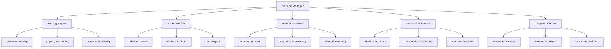

# ⏰ Timed Session Implementation Plan

**Technical implementation of the world-class timed hookah session system**

---

## 🏗️ System Architecture

### Core Components



---

## 📊 Database Schema Extensions

### Enhanced Session Model

```sql
-- Extended Session table for timed sessions
ALTER TABLE sessions ADD COLUMN session_tier VARCHAR(20) NOT NULL DEFAULT 'BASIC';
ALTER TABLE sessions ADD COLUMN duration_minutes INTEGER NOT NULL DEFAULT 45;
ALTER TABLE sessions ADD COLUMN base_price_cents INTEGER NOT NULL;
ALTER TABLE sessions ADD COLUMN dynamic_price_cents INTEGER NOT NULL;
ALTER TABLE sessions ADD COLUMN extension_count INTEGER DEFAULT 0;
ALTER TABLE sessions ADD COLUMN total_extensions_minutes INTEGER DEFAULT 0;
ALTER TABLE sessions ADD COLUMN peak_hour_multiplier DECIMAL(3,2) DEFAULT 1.0;
ALTER TABLE sessions ADD COLUMN loyalty_discount_percent DECIMAL(5,2) DEFAULT 0.0;
ALTER TABLE sessions ADD COLUMN auto_extend_enabled BOOLEAN DEFAULT FALSE;
ALTER TABLE sessions ADD COLUMN grace_period_minutes INTEGER DEFAULT 5;
ALTER TABLE sessions ADD COLUMN session_quality_rating INTEGER;
ALTER TABLE sessions ADD COLUMN customer_satisfaction_score INTEGER;

-- Session tiers enum
CREATE TYPE session_tier AS ENUM ('BASIC', 'PREMIUM', 'VIP');

-- Session extensions table
CREATE TABLE session_extensions (
    id UUID PRIMARY KEY DEFAULT gen_random_uuid(),
    session_id UUID REFERENCES sessions(id) ON DELETE CASCADE,
    extension_minutes INTEGER NOT NULL,
    extension_price_cents INTEGER NOT NULL,
    extension_type VARCHAR(20) NOT NULL, -- 'MANUAL', 'AUTO', 'GRACE'
    created_at TIMESTAMP DEFAULT NOW(),
    created_by UUID REFERENCES users(id)
);

-- Dynamic pricing rules table
CREATE TABLE pricing_rules (
    id UUID PRIMARY KEY DEFAULT gen_random_uuid(),
    rule_name VARCHAR(100) NOT NULL,
    rule_type VARCHAR(50) NOT NULL, -- 'PEAK_HOUR', 'DEMAND', 'LOYALTY', 'SEASONAL'
    start_time TIME,
    end_time TIME,
    day_of_week INTEGER[], -- 0=Sunday, 1=Monday, etc.
    multiplier DECIMAL(3,2) NOT NULL,
    min_occupancy_rate DECIMAL(3,2),
    max_occupancy_rate DECIMAL(3,2),
    loyalty_tier VARCHAR(20),
    is_active BOOLEAN DEFAULT TRUE,
    created_at TIMESTAMP DEFAULT NOW(),
    updated_at TIMESTAMP DEFAULT NOW()
);

-- Customer loyalty table
CREATE TABLE customer_loyalty (
    id UUID PRIMARY KEY DEFAULT gen_random_uuid(),
    customer_id VARCHAR(100) NOT NULL,
    customer_email VARCHAR(255),
    customer_phone VARCHAR(20),
    loyalty_tier VARCHAR(20) NOT NULL DEFAULT 'BRONZE',
    total_points INTEGER DEFAULT 0,
    lifetime_spent_cents INTEGER DEFAULT 0,
    session_count INTEGER DEFAULT 0,
    last_visit TIMESTAMP,
    created_at TIMESTAMP DEFAULT NOW(),
    updated_at TIMESTAMP DEFAULT NOW(),
    UNIQUE(customer_id)
);

-- Session analytics table
CREATE TABLE session_analytics (
    id UUID PRIMARY KEY DEFAULT gen_random_uuid(),
    session_id UUID REFERENCES sessions(id) ON DELETE CASCADE,
    revenue_cents INTEGER NOT NULL,
    duration_minutes INTEGER NOT NULL,
    extension_count INTEGER DEFAULT 0,
    peak_hour BOOLEAN DEFAULT FALSE,
    loyalty_tier VARCHAR(20),
    customer_satisfaction INTEGER,
    staff_efficiency_score DECIMAL(3,2),
    table_utilization_rate DECIMAL(3,2),
    created_at TIMESTAMP DEFAULT NOW()
);
```

---

## ⚙️ Core Services Implementation

### 1. Session Manager Service

```typescript
// apps/app/lib/services/SessionManager.ts
export class SessionManager {
  private db: PrismaClient;
  private pricingEngine: PricingEngine;
  private timerService: TimerService;
  private notificationService: NotificationService;

  constructor() {
    this.db = new PrismaClient();
    this.pricingEngine = new PricingEngine();
    this.timerService = new TimerService();
    this.notificationService = new NotificationService();
  }

  async createSession(data: CreateSessionData): Promise<Session> {
    // Calculate dynamic pricing
    const pricing = await this.pricingEngine.calculatePrice({
      tier: data.tier,
      startTime: data.startTime,
      customerId: data.customerId,
      tableId: data.tableId
    });

    // Create session with pricing
    const session = await this.db.session.create({
      data: {
        ...data,
        basePriceCents: pricing.basePrice,
        dynamicPriceCents: pricing.finalPrice,
        durationMinutes: pricing.duration,
        peakHourMultiplier: pricing.peakMultiplier,
        loyaltyDiscountPercent: pricing.loyaltyDiscount
      }
    });

    // Start timer
    await this.timerService.startSession(session.id, pricing.duration);

    // Send notifications
    await this.notificationService.sendSessionCreated(session);

    return session;
  }

  async extendSession(sessionId: string, minutes: number, customerId?: string): Promise<SessionExtension> {
    const session = await this.db.session.findUnique({
      where: { id: sessionId }
    });

    if (!session) {
      throw new Error('Session not found');
    }

    // Calculate extension pricing
    const extensionPricing = await this.pricingEngine.calculateExtensionPrice({
      sessionId,
      minutes,
      customerId,
      currentTime: new Date()
    });

    // Create extension
    const extension = await this.db.sessionExtension.create({
      data: {
        sessionId,
        extensionMinutes: minutes,
        extensionPriceCents: extensionPricing.price,
        extensionType: 'MANUAL'
      }
    });

    // Update session
    await this.db.session.update({
      where: { id: sessionId },
      data: {
        extensionCount: { increment: 1 },
        totalExtensionsMinutes: { increment: minutes },
        durationMinutes: { increment: minutes }
      }
    });

    // Extend timer
    await this.timerService.extendSession(sessionId, minutes);

    // Send notifications
    await this.notificationService.sendSessionExtended(session, extension);

    return extension;
  }

  async endSession(sessionId: string, reason: 'COMPLETED' | 'CANCELLED' | 'EXPIRED'): Promise<Session> {
    const session = await this.db.session.findUnique({
      where: { id: sessionId }
    });

    if (!session) {
      throw new Error('Session not found');
    }

    // Calculate final duration
    const actualDuration = await this.timerService.getActualDuration(sessionId);
    
    // Update session
    const updatedSession = await this.db.session.update({
      where: { id: sessionId },
      data: {
        state: reason === 'COMPLETED' ? 'COMPLETED' : 'CANCELLED',
        endedAt: new Date(),
        durationSecs: actualDuration * 60
      }
    });

    // Stop timer
    await this.timerService.stopSession(sessionId);

    // Send notifications
    await this.notificationService.sendSessionEnded(updatedSession, reason);

    // Record analytics
    await this.recordSessionAnalytics(updatedSession);

    return updatedSession;
  }

  private async recordSessionAnalytics(session: Session): Promise<void> {
    await this.db.sessionAnalytics.create({
      data: {
        sessionId: session.id,
        revenueCents: session.dynamicPriceCents,
        durationMinutes: session.durationMinutes,
        extensionCount: session.extensionCount,
        peakHour: session.peakHourMultiplier > 1.0,
        loyaltyTier: session.loyaltyDiscountPercent > 0 ? 'LOYALTY' : 'NONE',
        customerSatisfaction: session.customerSatisfactionScore,
        tableUtilizationRate: await this.calculateTableUtilization(session.tableId)
      }
    });
  }
}
```

### 2. Dynamic Pricing Engine

```typescript
// apps/app/lib/services/PricingEngine.ts
export class PricingEngine {
  private db: PrismaClient;
  private pricingRules: PricingRule[] = [];

  constructor() {
    this.db = new PrismaClient();
    this.loadPricingRules();
  }

  async calculatePrice(params: PricingParams): Promise<PricingResult> {
    const basePrice = this.getBasePrice(params.tier);
    const currentTime = new Date();
    
    // Apply dynamic pricing rules
    const peakMultiplier = await this.getPeakHourMultiplier(currentTime);
    const demandMultiplier = await this.getDemandMultiplier(params.tableId);
    const loyaltyDiscount = await this.getLoyaltyDiscount(params.customerId);
    const seasonalMultiplier = await this.getSeasonalMultiplier(currentTime);

    const finalPrice = Math.round(
      basePrice * 
      peakMultiplier * 
      demandMultiplier * 
      seasonalMultiplier * 
      (1 - loyaltyDiscount)
    );

    return {
      basePrice,
      finalPrice,
      duration: this.getDuration(params.tier),
      peakMultiplier,
      demandMultiplier,
      loyaltyDiscount,
      seasonalMultiplier,
      breakdown: {
        base: basePrice,
        peak: peakMultiplier,
        demand: demandMultiplier,
        loyalty: loyaltyDiscount,
        seasonal: seasonalMultiplier
      }
    };
  }

  async calculateExtensionPrice(params: ExtensionPricingParams): Promise<number> {
    const baseExtensionPrice = 800; // $8 per 15 minutes
    const currentTime = new Date();
    
    // Apply extension-specific pricing rules
    const urgencyMultiplier = this.getUrgencyMultiplier(params.minutes, params.currentTime);
    const loyaltyDiscount = await this.getLoyaltyDiscount(params.customerId);
    const peakMultiplier = await this.getPeakHourMultiplier(currentTime);

    return Math.round(
      baseExtensionPrice * 
      urgencyMultiplier * 
      peakMultiplier * 
      (1 - loyaltyDiscount)
    );
  }

  private getBasePrice(tier: SessionTier): number {
    const prices = {
      'BASIC': 2500,    // $25
      'PREMIUM': 3500,  // $35
      'VIP': 5000       // $50
    };
    return prices[tier];
  }

  private getDuration(tier: SessionTier): number {
    const durations = {
      'BASIC': 45,
      'PREMIUM': 60,
      'VIP': 90
    };
    return durations[tier];
  }

  private getUrgencyMultiplier(minutes: number, currentTime: Date): number {
    // More urgent = higher price
    if (minutes <= 2) return 1.5;  // 50% premium for last-minute
    if (minutes <= 5) return 1.2;  // 20% premium for urgent
    return 1.0; // Standard rate
  }

  private async getPeakHourMultiplier(time: Date): Promise<number> {
    const hour = time.getHours();
    const dayOfWeek = time.getDay();
    
    // Peak hours: 7-11 PM, Friday-Sunday
    const isPeakHour = hour >= 19 && hour <= 23;
    const isWeekend = dayOfWeek === 5 || dayOfWeek === 6 || dayOfWeek === 0;
    
    if (isPeakHour && isWeekend) return 1.5; // 50% premium
    if (isPeakHour) return 1.2; // 20% premium
    return 1.0; // Standard rate
  }

  private async getDemandMultiplier(tableId: string): Promise<number> {
    // Calculate current occupancy rate
    const totalTables = 12; // Assuming 12 tables
    const activeSessions = await this.db.session.count({
      where: {
        state: { in: ['ACTIVE', 'PREP_IN_PROGRESS', 'READY_FOR_DELIVERY'] }
      }
    });
    
    const occupancyRate = activeSessions / totalTables;
    
    if (occupancyRate >= 0.9) return 1.3; // 30% premium for high demand
    if (occupancyRate >= 0.7) return 1.1; // 10% premium for medium demand
    return 1.0; // Standard rate
  }

  private async getLoyaltyDiscount(customerId?: string): Promise<number> {
    if (!customerId) return 0;
    
    const loyalty = await this.db.customerLoyalty.findUnique({
      where: { customerId }
    });
    
    if (!loyalty) return 0;
    
    const discounts = {
      'BRONZE': 0.05,  // 5% discount
      'SILVER': 0.10,  // 10% discount
      'GOLD': 0.15,    // 15% discount
      'PLATINUM': 0.20 // 20% discount
    };
    
    return discounts[loyalty.loyaltyTier] || 0;
  }
}
```

### 3. Timer Service

```typescript
// apps/app/lib/services/TimerService.ts
export class TimerService {
  private activeTimers: Map<string, NodeJS.Timeout> = new Map();
  private sessionData: Map<string, SessionTimerData> = new Map();

  async startSession(sessionId: string, durationMinutes: number): Promise<void> {
    const durationMs = durationMinutes * 60 * 1000;
    
    // Store session data
    this.sessionData.set(sessionId, {
      startTime: Date.now(),
      durationMs,
      remainingMs: durationMs,
      isPaused: false,
      extensions: []
    });

    // Start timer
    const timer = setTimeout(async () => {
      await this.handleSessionExpiry(sessionId);
    }, durationMs);

    this.activeTimers.set(sessionId, timer);

    // Send start notification
    await this.sendTimerNotification(sessionId, 'SESSION_STARTED');
  }

  async extendSession(sessionId: string, minutes: number): Promise<void> {
    const sessionData = this.sessionData.get(sessionId);
    if (!sessionData) {
      throw new Error('Session not found');
    }

    // Clear existing timer
    const existingTimer = this.activeTimers.get(sessionId);
    if (existingTimer) {
      clearTimeout(existingTimer);
    }

    // Add extension
    const extensionMs = minutes * 60 * 1000;
    sessionData.remainingMs += extensionMs;
    sessionData.extensions.push({
      minutes,
      addedAt: Date.now()
    });

    // Start new timer
    const timer = setTimeout(async () => {
      await this.handleSessionExpiry(sessionId);
    }, sessionData.remainingMs);

    this.activeTimers.set(sessionId, timer);

    // Send extension notification
    await this.sendTimerNotification(sessionId, 'SESSION_EXTENDED', { minutes });
  }

  async pauseSession(sessionId: string): Promise<void> {
    const sessionData = this.sessionData.get(sessionId);
    if (!sessionData || sessionData.isPaused) return;

    // Clear timer
    const timer = this.activeTimers.get(sessionId);
    if (timer) {
      clearTimeout(timer);
      this.activeTimers.delete(sessionId);
    }

    // Update remaining time
    const elapsed = Date.now() - sessionData.startTime;
    sessionData.remainingMs = Math.max(0, sessionData.remainingMs - elapsed);
    sessionData.isPaused = true;

    // Send pause notification
    await this.sendTimerNotification(sessionId, 'SESSION_PAUSED');
  }

  async resumeSession(sessionId: string): Promise<void> {
    const sessionData = this.sessionData.get(sessionId);
    if (!sessionData || !sessionData.isPaused) return;

    // Update start time
    sessionData.startTime = Date.now();
    sessionData.isPaused = false;

    // Start timer
    const timer = setTimeout(async () => {
      await this.handleSessionExpiry(sessionId);
    }, sessionData.remainingMs);

    this.activeTimers.set(sessionId, timer);

    // Send resume notification
    await this.sendTimerNotification(sessionId, 'SESSION_RESUMED');
  }

  async stopSession(sessionId: string): Promise<void> {
    // Clear timer
    const timer = this.activeTimers.get(sessionId);
    if (timer) {
      clearTimeout(timer);
      this.activeTimers.delete(sessionId);
    }

    // Clean up data
    this.sessionData.delete(sessionId);

    // Send stop notification
    await this.sendTimerNotification(sessionId, 'SESSION_STOPPED');
  }

  async getSessionStatus(sessionId: string): Promise<SessionTimerStatus> {
    const sessionData = this.sessionData.get(sessionId);
    if (!sessionData) {
      throw new Error('Session not found');
    }

    const now = Date.now();
    const elapsed = sessionData.isPaused ? 0 : now - sessionData.startTime;
    const remainingMs = Math.max(0, sessionData.remainingMs - elapsed);
    const remainingMinutes = Math.ceil(remainingMs / (60 * 1000));

    return {
      sessionId,
      remainingMinutes,
      isPaused: sessionData.isPaused,
      extensions: sessionData.extensions,
      totalDuration: sessionData.durationMs / (60 * 1000),
      elapsed: elapsed / (60 * 1000)
    };
  }

  private async handleSessionExpiry(sessionId: string): Promise<void> {
    // Send expiry notification
    await this.sendTimerNotification(sessionId, 'SESSION_EXPIRED');

    // Start grace period
    await this.startGracePeriod(sessionId);

    // Clean up timer
    this.activeTimers.delete(sessionId);
  }

  private async startGracePeriod(sessionId: string): Promise<void> {
    const gracePeriodMs = 5 * 60 * 1000; // 5 minutes grace period

    const timer = setTimeout(async () => {
      await this.handleGracePeriodExpiry(sessionId);
    }, gracePeriodMs);

    this.activeTimers.set(sessionId, timer);

    // Send grace period notification
    await this.sendTimerNotification(sessionId, 'GRACE_PERIOD_STARTED');
  }

  private async handleGracePeriodExpiry(sessionId: string): Promise<void> {
    // Force end session
    await this.sendTimerNotification(sessionId, 'SESSION_FORCE_ENDED');
    
    // Clean up
    this.activeTimers.delete(sessionId);
    this.sessionData.delete(sessionId);
  }

  private async sendTimerNotification(sessionId: string, event: string, data?: any): Promise<void> {
    // Implementation for sending real-time notifications
    // This would integrate with WebSocket or Server-Sent Events
    console.log(`Timer Event: ${event} for session ${sessionId}`, data);
  }
}
```

---

## 📱 Frontend Components

### 1. Session Timer Component

```typescript
// apps/app/components/SessionTimer.tsx
interface SessionTimerProps {
  sessionId: string;
  onTimeUp: () => void;
  onExtension: (minutes: number) => void;
  onPause: () => void;
  onResume: () => void;
}

export function SessionTimer({ sessionId, onTimeUp, onExtension, onPause, onResume }: SessionTimerProps) {
  const [status, setStatus] = useState<SessionTimerStatus | null>(null);
  const [isLoading, setIsLoading] = useState(true);

  useEffect(() => {
    const fetchStatus = async () => {
      try {
        const response = await fetch(`/api/sessions/${sessionId}/timer`);
        const data = await response.json();
        setStatus(data);
      } catch (error) {
        console.error('Failed to fetch timer status:', error);
      } finally {
        setIsLoading(false);
      }
    };

    fetchStatus();
    
    // Poll for updates every 30 seconds
    const interval = setInterval(fetchStatus, 30000);
    return () => clearInterval(interval);
  }, [sessionId]);

  const handleExtension = async (minutes: number) => {
    try {
      const response = await fetch(`/api/sessions/${sessionId}/extend`, {
        method: 'POST',
        headers: { 'Content-Type': 'application/json' },
        body: JSON.stringify({ minutes })
      });
      
      if (response.ok) {
        onExtension(minutes);
        // Refresh status
        const data = await response.json();
        setStatus(data);
      }
    } catch (error) {
      console.error('Failed to extend session:', error);
    }
  };

  if (isLoading) {
    return <div className="animate-pulse bg-gray-200 h-32 rounded-lg"></div>;
  }

  if (!status) {
    return <div className="text-red-500">Failed to load timer</div>;
  }

  const progressPercentage = (status.elapsed / status.totalDuration) * 100;
  const isLowTime = status.remainingMinutes <= 5;
  const isUrgent = status.remainingMinutes <= 2;

  return (
    <div className="bg-gradient-to-r from-blue-500 to-purple-600 p-6 rounded-lg text-white">
      <div className="flex items-center justify-between mb-4">
        <h3 className="text-xl font-bold">Session Timer</h3>
        <div className="flex space-x-2">
          {status.isPaused ? (
            <button
              onClick={onResume}
              className="bg-green-500 hover:bg-green-600 px-4 py-2 rounded-lg"
            >
              Resume
            </button>
          ) : (
            <button
              onClick={onPause}
              className="bg-yellow-500 hover:bg-yellow-600 px-4 py-2 rounded-lg"
            >
              Pause
            </button>
          )}
        </div>
      </div>

      <div className="mb-4">
        <div className="flex justify-between text-sm mb-2">
          <span>Time Remaining</span>
          <span className={isUrgent ? 'text-red-300' : isLowTime ? 'text-yellow-300' : 'text-white'}>
            {status.remainingMinutes} minutes
          </span>
        </div>
        <div className="w-full bg-gray-200 rounded-full h-3">
          <div
            className={`h-3 rounded-full transition-all duration-1000 ${
              isUrgent ? 'bg-red-500' : isLowTime ? 'bg-yellow-500' : 'bg-green-500'
            }`}
            style={{ width: `${100 - progressPercentage}%` }}
          />
        </div>
      </div>

      <div className="flex space-x-2">
        <button
          onClick={() => handleExtension(15)}
          className="bg-white text-blue-600 hover:bg-gray-100 px-4 py-2 rounded-lg font-medium"
        >
          +15 min ($8)
        </button>
        <button
          onClick={() => handleExtension(30)}
          className="bg-white text-blue-600 hover:bg-gray-100 px-4 py-2 rounded-lg font-medium"
        >
          +30 min ($15)
        </button>
        <button
          onClick={() => handleExtension(60)}
          className="bg-white text-blue-600 hover:bg-gray-100 px-4 py-2 rounded-lg font-medium"
        >
          +60 min ($25)
        </button>
      </div>

      {status.extensions.length > 0 && (
        <div className="mt-4 text-sm">
          <p>Extensions: {status.extensions.length}</p>
        </div>
      )}
    </div>
  );
}
```

### 2. Dynamic Pricing Display

```typescript
// apps/app/components/DynamicPricing.tsx
interface DynamicPricingProps {
  tier: SessionTier;
  tableId: string;
  customerId?: string;
}

export function DynamicPricing({ tier, tableId, customerId }: DynamicPricingProps) {
  const [pricing, setPricing] = useState<PricingResult | null>(null);
  const [isLoading, setIsLoading] = useState(true);

  useEffect(() => {
    const fetchPricing = async () => {
      try {
        const response = await fetch('/api/pricing/calculate', {
          method: 'POST',
          headers: { 'Content-Type': 'application/json' },
          body: JSON.stringify({ tier, tableId, customerId })
        });
        
        const data = await response.json();
        setPricing(data);
      } catch (error) {
        console.error('Failed to fetch pricing:', error);
      } finally {
        setIsLoading(false);
      }
    };

    fetchPricing();
    
    // Refresh pricing every 5 minutes
    const interval = setInterval(fetchPricing, 5 * 60 * 1000);
    return () => clearInterval(interval);
  }, [tier, tableId, customerId]);

  if (isLoading) {
    return <div className="animate-pulse bg-gray-200 h-24 rounded-lg"></div>;
  }

  if (!pricing) {
    return <div className="text-red-500">Failed to load pricing</div>;
  }

  const savings = pricing.basePrice - pricing.finalPrice;
  const savingsPercent = Math.round((savings / pricing.basePrice) * 100);

  return (
    <div className="bg-white p-6 rounded-lg shadow-lg">
      <div className="flex items-center justify-between mb-4">
        <h3 className="text-xl font-bold text-gray-800">
          {tier} Session - {pricing.duration} minutes
        </h3>
        <div className="text-right">
          <div className="text-2xl font-bold text-green-600">
            ${(pricing.finalPrice / 100).toFixed(2)}
          </div>
          {savings > 0 && (
            <div className="text-sm text-green-500">
              Save ${(savings / 100).toFixed(2)} ({savingsPercent}%)
            </div>
          )}
        </div>
      </div>

      <div className="space-y-2 text-sm text-gray-600">
        <div className="flex justify-between">
          <span>Base Price:</span>
          <span>${(pricing.basePrice / 100).toFixed(2)}</span>
        </div>
        
        {pricing.peakMultiplier > 1 && (
          <div className="flex justify-between">
            <span>Peak Hour (+{Math.round((pricing.peakMultiplier - 1) * 100)}%):</span>
            <span>+${(pricing.basePrice * (pricing.peakMultiplier - 1) / 100).toFixed(2)}</span>
          </div>
        )}
        
        {pricing.demandMultiplier > 1 && (
          <div className="flex justify-between">
            <span>High Demand (+{Math.round((pricing.demandMultiplier - 1) * 100)}%):</span>
            <span>+${(pricing.basePrice * (pricing.demandMultiplier - 1) / 100).toFixed(2)}</span>
          </div>
        )}
        
        {pricing.loyaltyDiscount > 0 && (
          <div className="flex justify-between text-green-600">
            <span>Loyalty Discount (-{Math.round(pricing.loyaltyDiscount * 100)}%):</span>
            <span>-${(savings / 100).toFixed(2)}</span>
          </div>
        )}
      </div>

      <div className="mt-4 p-3 bg-blue-50 rounded-lg">
        <p className="text-sm text-blue-800">
          💡 <strong>Pro Tip:</strong> Book during off-peak hours to save money!
        </p>
      </div>
    </div>
  );
}
```

---

## 🔄 API Endpoints

### Session Management APIs

```typescript
// apps/app/app/api/sessions/route.ts
export async function POST(req: NextRequest) {
  try {
    const { tier, tableId, customerId, startTime } = await req.json();
    
    const sessionManager = new SessionManager();
    const session = await sessionManager.createSession({
      tier,
      tableId,
      customerId,
      startTime: startTime ? new Date(startTime) : new Date()
    });
    
    return NextResponse.json(session);
  } catch (error) {
    console.error('Session creation error:', error);
    return NextResponse.json({ error: 'Failed to create session' }, { status: 500 });
  }
}

// apps/app/app/api/sessions/[id]/extend/route.ts
export async function POST(req: NextRequest, { params }: { params: { id: string } }) {
  try {
    const { minutes, customerId } = await req.json();
    
    const sessionManager = new SessionManager();
    const extension = await sessionManager.extendSession(params.id, minutes, customerId);
    
    return NextResponse.json(extension);
  } catch (error) {
    console.error('Session extension error:', error);
    return NextResponse.json({ error: 'Failed to extend session' }, { status: 500 });
  }
}

// apps/app/app/api/sessions/[id]/timer/route.ts
export async function GET(req: NextRequest, { params }: { params: { id: string } }) {
  try {
    const timerService = new TimerService();
    const status = await timerService.getSessionStatus(params.id);
    
    return NextResponse.json(status);
  } catch (error) {
    console.error('Timer status error:', error);
    return NextResponse.json({ error: 'Failed to get timer status' }, { status: 500 });
  }
}

// apps/app/app/api/pricing/calculate/route.ts
export async function POST(req: NextRequest) {
  try {
    const { tier, tableId, customerId } = await req.json();
    
    const pricingEngine = new PricingEngine();
    const pricing = await pricingEngine.calculatePrice({
      tier,
      tableId,
      customerId
    });
    
    return NextResponse.json(pricing);
  } catch (error) {
    console.error('Pricing calculation error:', error);
    return NextResponse.json({ error: 'Failed to calculate pricing' }, { status: 500 });
  }
}
```

---

## 📊 Analytics & Reporting

### Revenue Analytics Dashboard

```typescript
// apps/app/lib/services/AnalyticsService.ts
export class AnalyticsService {
  private db: PrismaClient;

  constructor() {
    this.db = new PrismaClient();
  }

  async getRevenueAnalytics(dateRange: DateRange): Promise<RevenueAnalytics> {
    const sessions = await this.db.sessionAnalytics.findMany({
      where: {
        created_at: {
          gte: dateRange.start,
          lte: dateRange.end
        }
      }
    });

    const totalRevenue = sessions.reduce((sum, session) => sum + session.revenue_cents, 0);
    const totalSessions = sessions.length;
    const averageRevenuePerSession = totalSessions > 0 ? totalRevenue / totalSessions : 0;
    
    const peakHourRevenue = sessions
      .filter(s => s.peak_hour)
      .reduce((sum, session) => sum + session.revenue_cents, 0);
    
    const loyaltyRevenue = sessions
      .filter(s => s.loyalty_tier !== 'NONE')
      .reduce((sum, session) => sum + session.revenue_cents, 0);

    return {
      totalRevenue,
      totalSessions,
      averageRevenuePerSession,
      peakHourRevenue,
      loyaltyRevenue,
      peakHourPercentage: totalRevenue > 0 ? (peakHourRevenue / totalRevenue) * 100 : 0,
      loyaltyPercentage: totalRevenue > 0 ? (loyaltyRevenue / totalRevenue) * 100 : 0
    };
  }

  async getSessionMetrics(dateRange: DateRange): Promise<SessionMetrics> {
    const sessions = await this.db.sessionAnalytics.findMany({
      where: {
        created_at: {
          gte: dateRange.start,
          lte: dateRange.end
        }
      }
    });

    const averageDuration = sessions.reduce((sum, s) => sum + s.duration_minutes, 0) / sessions.length;
    const averageExtensions = sessions.reduce((sum, s) => sum + s.extension_count, 0) / sessions.length;
    const extensionRate = sessions.filter(s => s.extension_count > 0).length / sessions.length;
    const averageSatisfaction = sessions.reduce((sum, s) => sum + (s.customer_satisfaction || 0), 0) / sessions.length;

    return {
      averageDuration,
      averageExtensions,
      extensionRate,
      averageSatisfaction,
      totalSessions: sessions.length
    };
  }

  async getTableUtilization(dateRange: DateRange): Promise<TableUtilization> {
    const sessions = await this.db.sessionAnalytics.findMany({
      where: {
        created_at: {
          gte: dateRange.start,
          lte: dateRange.end
        }
      }
    });

    const totalTableHours = 12 * 24 * Math.ceil((dateRange.end.getTime() - dateRange.start.getTime()) / (1000 * 60 * 60 * 24));
    const utilizedTableHours = sessions.reduce((sum, s) => sum + s.duration_minutes, 0) / 60;
    
    return {
      utilizationRate: (utilizedTableHours / totalTableHours) * 100,
      totalTableHours,
      utilizedTableHours,
      averageSessionsPerTable: sessions.length / 12
    };
  }
}
```

---

## 🚀 Implementation Timeline

### Phase 1: Core System (Weeks 1-4)
- [ ] Database schema implementation
- [ ] Basic session management
- [ ] Timer service implementation
- [ ] Payment integration
- [ ] Basic UI components

### Phase 2: Dynamic Pricing (Weeks 5-8)
- [ ] Pricing engine implementation
- [ ] Peak hour detection
- [ ] Demand-based pricing
- [ ] Loyalty discount system
- [ ] Pricing UI components

### Phase 3: Advanced Features (Weeks 9-12)
- [ ] Session extensions
- [ ] Real-time notifications
- [ ] Analytics dashboard
- [ ] Staff management tools
- [ ] Customer loyalty program

### Phase 4: Optimization (Weeks 13-16)
- [ ] Performance optimization
- [ ] A/B testing framework
- [ ] Advanced analytics
- [ ] Mobile app integration
- [ ] Launch preparation

---

## 🎯 Success Metrics

### Revenue Metrics
- **Monthly Recurring Revenue (MRR):** $50K+ per location
- **Average Revenue Per User (ARPU):** $45+ per session
- **Revenue per Table Hour:** $25+ per hour
- **Session Extension Rate:** 40%+ of sessions
- **Premium Tier Adoption:** 30%+ of sessions

### Operational Metrics
- **Table Turnover Rate:** 4+ sessions per table per day
- **Staff Efficiency:** 15+ orders per staff per shift
- **Customer Satisfaction:** 4.5+ stars average
- **System Uptime:** 99.9%+ availability
- **Payment Success Rate:** 98%+ of transactions

### Customer Metrics
- **Customer Retention Rate:** 60%+ monthly retention
- **Loyalty Program Enrollment:** 70%+ of customers
- **App Usage Rate:** 80%+ of customers use app
- **Social Sharing Rate:** 30%+ of sessions shared
- **Referral Rate:** 25%+ of new customers

---

**Document Version:** 1.0  
**Created:** October 6, 2025  
**Status:** Ready for Implementation  
**Next Steps:** Begin Phase 1 development

